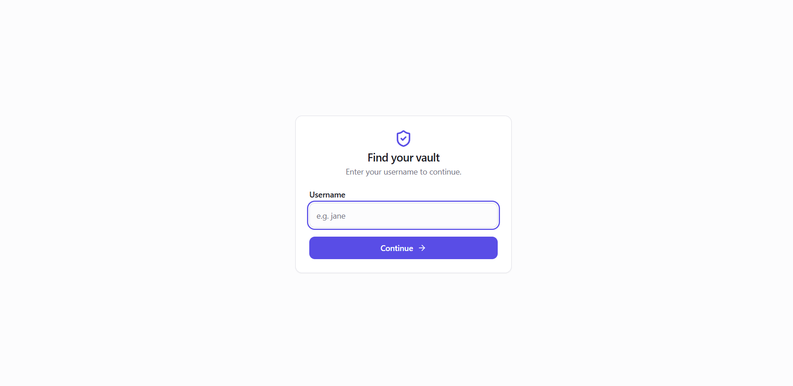
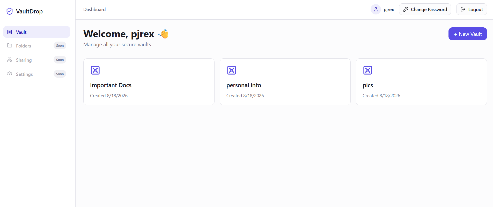
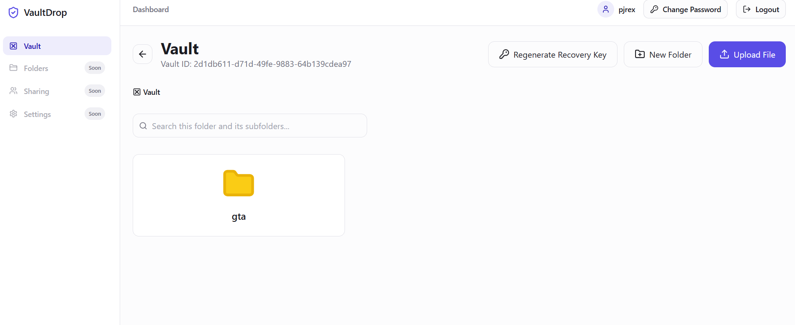
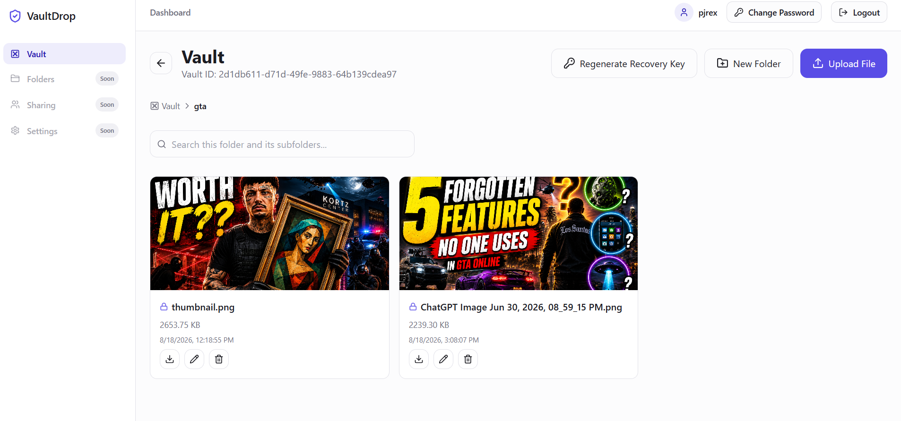
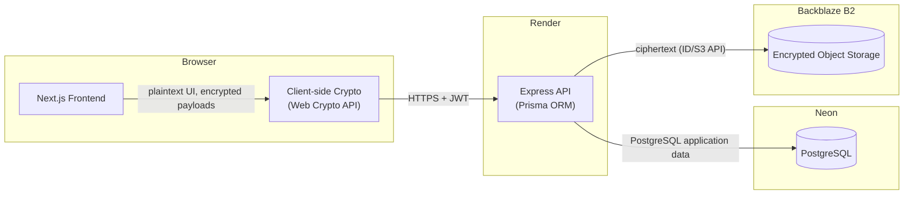

# VaultDrop

[](https://github.com/Jenoyrex/VaultDrop/actions/workflows/ci.yml)

A private file vault with client-side encryption — your password never leaves your browser, and the server never sees the keys that protect your files.

### 🔗 [Live Demo →](https://vaultdrop95.netlify.app)

Deployed and usable end-to-end today: create an account, create an encrypted vault, upload a file, and download it back — all against live infrastructure (Netlify, Render, Neon, Backblaze B2).

<sub>API: [vaultdrop-api-jzrc.onrender.com](https://vaultdrop-api-jzrc.onrender.com) · Repository: [github.com/Jenoyrex/VaultDrop](https://github.com/Jenoyrex/VaultDrop)</sub>

---

## Overview

VaultDrop is a full-stack file storage application built around a simple idea: the server should be able to store and serve your files without ever being able to read them. Vault contents are encrypted in the browser before upload using keys derived from your password. The server stores ciphertext, not plaintext, and never receives the key material needed to decrypt it.

It's a monorepo with a Next.js frontend, an Express/Prisma API, PostgreSQL for metadata, and Backblaze B2 (S3-compatible) for encrypted object storage.

### Screenshots

<table>
<tr>
<td width="50%">

**Vault access**

Enter your username to locate your vault before authenticating.

</td>
<td width="50%">

**Dashboard**

Overview of all vaults belonging to the signed-in user, with quick access to create a new one.

</td>
</tr>
<tr>
<td width="50%">

**Vault / folder view**

Browsing a vault's contents, including folder navigation and vault management actions.

</td>
<td width="50%">

**Vault / file view**

Encrypted files within a folder, each shown with size, timestamp, and download/edit/delete actions.

</td>
</tr>
</table>

---

## Why VaultDrop / Privacy Model

Most "secure" file storage products encrypt data at rest on the server — which means the provider still holds the keys and could, in principle, read your files. VaultDrop's encryption model is different: keys are derived and used entirely client-side, so the server is never in possession of anything it could use to decrypt file contents or file/folder names.

**Protected (never leaves the browser in usable form):** file contents, file and folder names, and every encryption key involved.

**Server-visible by design (not encrypted):** account username, vault name, file size and MIME type, folder structure, timestamps, and the storage location of the ciphertext. The application needs this metadata to list, sort, and serve files without ever touching their contents — VaultDrop does not claim full end-to-end encryption of every field in the system, only of file contents, names, and keys.

Encryption is **mandatory for every new vault** — the vault-creation API rejects requests missing a complete encryption envelope. (Vaults created before this requirement existed may still remain as unencrypted legacy data; the requirement only closes the creation path going forward.)

---

## Key Features

- **Client-side encryption** of file contents and file/folder names, applied before anything leaves the browser (see full flow below)
- **Recovery key** for regaining vault access without a password reset, generated once at vault creation
- **Drag-and-drop file upload** and vault/folder browsing in the dashboard
- **Password strength feedback** during vault creation
- **Argon2id password hashing** with **JWT bearer** session auth
- **Nested folders** with per-user vault isolation
- **Pluggable storage layer**: local filesystem for development, Backblaze B2 (S3-compatible) in production
- **Rate limiting** on auth and API routes, and **security headers/CSP** (Helmet, nonce-based Content-Security-Policy)

---

## How the Encryption Flow Works

1. **Vault creation** — The browser generates a random vault Data Encryption Key (DEK). Your password is run through PBKDF2-SHA256 to derive a Key-Encryption-Key (KEK), which wraps (encrypts) the DEK with AES-256-GCM. A recovery key is also generated and used to wrap a second copy of the DEK. The server receives and stores only the wrapped (encrypted) DEK, the KEK's salt/iteration parameters, and the recovery-wrapped DEK — never the password, the KEK, the DEK, or the recovery key itself.
2. **Unlocking a vault** — Your password is re-derived into the same KEK (using the stored salt/iterations) and used to unwrap the stored DEK, entirely in-browser.
3. **Uploading a file** — The browser generates a random per-file content key, encrypts the file (in chunks, via AES-256-GCM) with it, and wraps that file key with the vault DEK. The server receives only ciphertext plus the wrapped file key — it cannot decrypt either.
4. **File and folder names** — Encrypted directly with the vault DEK before being sent to the server; the server stores only the ciphertext.
5. **Downloading** — The server returns the encrypted bytes and the wrapped file key; the browser unwraps the file key with the (already-unlocked) vault DEK and decrypts the file locally.
6. **Recovery** — If the password is lost, the recovery key (shown once at vault creation, meant to be stored offline) can unwrap the DEK independently of the password, restoring access without the server ever being involved in the key material.

All cryptographic operations use the browser's native Web Crypto API (`crypto.subtle`) — no key material is ever sent to the server in a usable form.

---

## Architecture



The frontend (Netlify) and API (Render) are deployed independently and communicate over HTTPS. The API is the only component with credentials for PostgreSQL (Neon) and Backblaze B2; it never has access to a user's password or any derived encryption key.

---

## Tech Stack

**Frontend**
- Next.js 14 (App Router), React 18, TypeScript
- Tailwind CSS, Radix UI primitives, Framer Motion

**Backend**
- Express, TypeScript
- Prisma ORM
- Argon2id (password hashing), JWT (session auth)
- Zod (request validation)

**Data & Storage**
- PostgreSQL (hosted on Neon)
- Backblaze B2 (S3-compatible object storage) for production; local filesystem adapter for development

**Infrastructure & Tooling**
- pnpm workspaces + Turborepo monorepo
- GitHub Actions CI (typecheck, test, build on every PR/push to main)
- Deployment: Netlify (frontend) + Render (API)

---

## Project Structure

```
vaultdrop/
├── apps/
│   ├── web/                  # Next.js frontend
│   │   └── src/
│   │       ├── app/          # App Router pages (landing, auth, dashboard)
│   │       ├── components/   # UI primitives, layout, providers
│   │       └── lib/
│   │           ├── crypto/   # Client-side encryption primitives (KDF, key-wrap,
│   │           │             # chunked cipher, recovery key)
│   │           ├── upload/   # Encrypt-then-upload pipeline
│   │           └── download/ # Download-then-decrypt pipeline
│   │
│   └── server/                # Express API
│       └── src/
│           ├── routes/        # auth, vault, folder, file routes
│           ├── services/      # business logic per domain
│           ├── storage/       # local + cloud (B2/S3) storage adapters
│           ├── middleware/    # auth, rate limiting, error handling
│           └── prisma/        # schema + migrations
│
├── packages/
│   ├── config/                 # Shared, validated environment config (server + web)
│   ├── crypto/                 # Shared server-side crypto (password hashing, JWT)
│   ├── types/                  # Shared TypeScript types (API contracts, entities)
│   └── ui/                     # Shared UI primitives
│
├── docker/                     # docker-compose for local PostgreSQL
├── .github/workflows/          # CI pipeline
├── pnpm-workspace.yaml
└── turbo.json
```

---

## Local Development / Getting Started

**Prerequisites:** Node.js ≥ 18.18, pnpm 9, Docker (optional, for local Postgres)

```bash
# Install dependencies
pnpm install

# Start a local PostgreSQL instance (or point DATABASE_URL at your own)
docker compose -f docker/docker-compose.yml up -d

# Copy environment templates
cp apps/server/.env.example apps/server/.env
cp apps/web/.env.example apps/web/.env

# Generate the Prisma client and apply migrations
pnpm db:generate
pnpm db:migrate

# Run both apps in dev mode
pnpm dev
```

By default, the web app runs on `http://localhost:3000` and the API on `http://localhost:4000`.

---

## Environment Configuration

Both apps ship a `.env.example` documenting every variable they read (`apps/server/.env.example`, `apps/web/.env.example`). Key ones:

**Server**
- `DATABASE_URL` / `DIRECT_URL` — pooled and direct PostgreSQL connection strings
- `JWT_SECRET` — must be changed from the placeholder before any production deploy (rejected at boot otherwise)
- `STORAGE_DRIVER` — `local` or `cloud`; `CLOUD_STORAGE_*` variables configure the S3-compatible endpoint (Backblaze B2 in production)
- `CORS_ORIGIN`, `MAX_UPLOAD_BYTES`, rate-limit tuning variables, `TRUST_PROXY_HOPS`

**Web**
- `NEXT_PUBLIC_API_URL` — base URL of the API

No real credentials are committed anywhere in this repository — only `.env.example` templates.

---

## Testing

```bash
pnpm typecheck   # TypeScript across the whole monorepo
pnpm test        # Vitest across all apps/packages
pnpm build       # Production build of every app/package
```

Test coverage includes, among others:
- Server-side vault creation, including enforcement of the mandatory encryption envelope on new vaults
- Auth flows (registration, login, password change, rate limiting)
- Encrypted file/folder name handling
- Upload and download routes
- Vault recovery
- Client-side crypto primitives (KDF, key-wrap, chunked cipher, recovery key encoding/decoding)

An opt-in live integration test exercises the real Backblaze B2 bucket (put → get → byte-for-byte comparison → delete). It's skipped in normal `pnpm test` runs and CI, and only runs when explicitly enabled with live credentials:

```bash
RUN_B2_LIVE_TEST=1 pnpm --filter server test cloud-storage-adapter.live
```

CI (GitHub Actions) runs typecheck, test, and build on every pull request and every push to `main`, without requiring a database or any external service — the test suite uses an in-memory Prisma stand-in and mocked storage adapters.

---

## Security Notes

- **Transport:** HTTPS in production (Netlify + Render)
- **HTTP hardening:** Helmet security headers, nonce-based Content-Security-Policy
- **Rate limiting:** separate budgets for auth endpoints and general API/upload/download traffic, keyed per-user where authenticated
- **Anti-enumeration:** login returns a generic error for both "wrong password" and "no such user"

A Phase 1 security review of the encryption and authentication design found no confirmed critical or high-severity exploitable issues, reflecting the review performed to date rather than an ongoing third-party audit.

---

## Production / Deployment

VaultDrop runs on real, independently deployed infrastructure:

| Component | Provider |
|---|---|
| Frontend | Netlify |
| API | Render |
| Database | Neon (PostgreSQL) |
| Object storage | Backblaze B2 |

The full production flow — account creation → login → vault creation → encrypted upload → storage in B2 → download → delete — has been manually verified end-to-end against live infrastructure with a fresh account.

---

## Current Status

VaultDrop is an actively developed, deployed project, currently in its first production phase. Implemented and live:

- Username/password authentication (Argon2id + JWT)
- Vault creation with mandatory client-side encryption
- Nested folders
- Encrypted file upload/download with client-side AES-256-GCM
- Encrypted file and folder names
- Recovery-key based vault recovery
- Production deployment across Netlify, Render, Neon, and Backblaze B2

## Roadmap / Phase 2

The following are planned, not yet implemented:

- File sharing between users
- Additional account/vault settings
- Broader UI coverage for folder and file management workflows
- Further hardening and expanded automated security testing

---

## License

No license has been chosen for this project yet. All rights reserved until a license is added.
